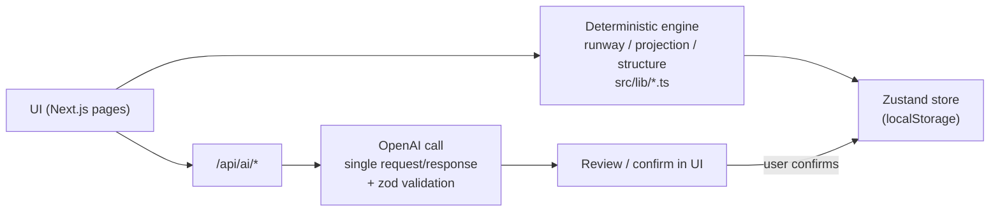

# Fintrack

> **"Est-ce que je tiens ce mois-ci, et que dois-je faire maintenant ?"**

## What it is

Fintrack is a personal cash-flow tool. It answers one question, every day: given what's coming in and what's committed to go out, does the money hold until the next paycheck — and if not, what's the earliest point of tension? Multi-account balances, a day-by-day projected balance curve, and what-if scenarios are deterministic; a few narrow features (transaction categorization, a one-line daily insight, natural-language scenario input, scanned-PDF import) are LLM-assisted.

## Problem

Most people don't know, at any given moment, whether their bank balance will hold until the end of the month — they find out when it's too late: the account is empty, a direct debit bounces, a decision has to be made in a panic. Existing tools are retrospective (you overspent on restaurants this month) or administrative (here's your budget by category). Fintrack is built to answer the forward-looking question instead: will it hold, and what's the earliest date it might not.

## Design principle

**Deterministic financial engine + LLM-assisted interpretation.** All financial math — balance, runway, the day-by-day projection curve, the "point bas du mois" (lowest projected balance before the next paycheck), scenario impact — is plain TypeScript, in `src/lib/`, covered by the test suite below. Nothing about balances or projections is generated by a model.

The AI layer sits on top and never has write access on its own: for scenarios specifically, this is an explicit rule (ADR-009, `docs/DECISIONS.md:148`) — *"Ce scénario est présenté à l'utilisateur pour validation avant toute écriture dans le store. L'IA ne peut jamais créer ou modifier un scénario silencieusement."* The same shape applies to the other AI features: the model proposes (a category, a one-line insight, parsed transactions from a statement), the deterministic store and the user's confirmation remain the source of truth.

## Core capabilities

Verified against the current code (`src/lib/`, `src/app/api/ai/`):

| Area | What it does |
|---|---|
| Runway / projection (`/`, `/focus`, `/timeline`) | Day-by-day projected balance curve from accounts + recurring items + scenarios — pure TypeScript |
| Multi-account | Balances split across checking/savings/credit/cash; runway computed from accounts flagged `includedInRunway` |
| Base Financière (`/base-financiere`) | Structured recurring income/expenses, each with a billing day, used to compute the month's low point |
| Scenarios (`/scenarios`) | What-if simulation on the projection; can be drafted from a natural-language sentence via `/api/ai/scenario-parse`, always shown for confirmation before it touches the store |
| Monthly review (`/review`) | Reconciliation, a fragility score, momentum, budget rollover — computed from transaction data, no LLM involved |
| Budget vs. réel (`/budget`) | Planned vs. actual spend by category |
| Statement import (`/import`) | CSV/Excel via `xlsx`; scanned PDFs are rasterized client-side (`pdfjs-dist`) and sent to a vision model for extraction |
| Patrimoine (`/patrimoine`) | Net worth tracking across assets/liabilities |

## AI usage

Four Next.js API routes under `src/app/api/ai/`, all using the `openai` SDK, all called with a plain `chat.completions.create` — **no tool/function calling, no agent, no orchestration, no memory between calls:**

| Route | Model | Does |
|---|---|---|
| `categorize` | `gpt-4o-mini` | Suggests a spending category for an imported transaction |
| `insight` | `gpt-4o-mini` | Produces one short "insight + action" line for the day/month view |
| `scenario-parse` | `gpt-4o-mini` | Parses a natural-language sentence into a structured scenario draft |
| `pdf-parse` | `gpt-4o` (vision) / `gpt-4o-mini` (text) | Reads a scanned bank statement (image) or text-based PDF and extracts transactions |

Every route is **one prompt in, one JSON response out** — validated against a zod schema before use (`src/lib/ai/schemas.ts`), with a graceful fallback (static default, or the deterministic value) if the call fails or the API key is missing. That's the full extent of it: structured-output prompting, not tool use, not a multi-step agent.

**What the AI does not do:** change a stored balance, transaction, or scenario without the user confirming it first; run more than one step per request; retain anything between requests.

## Architecture



## Data / document import

CSV and Excel statements are parsed locally (`xlsx`). Scanned PDF statements are rendered to images in the browser (`pdfjs-dist`) and sent to `gpt-4o` (vision) for extraction; text-based PDFs go to `gpt-4o-mini`. In both cases the extracted transactions are shown to the user before anything is written to the store — the same review-before-write pattern as scenarios.

## Testing

Run 2026-09-01, on the current codebase:

- `npx vitest run` — **45/45 tests passed** (`src/lib/__tests__/{budget,projection,runway,timeline}.test.ts`). Covers the deterministic engine only — no test currently exercises the AI routes directly (their zod-validated parsing is the main risk surface; this is a known gap, not hidden).
- `npx tsc --noEmit` — 0 errors.
- `npm run lint` — 0 errors, 56 warnings (unused variables and a few `react-hooks/exhaustive-deps` warnings, concentrated in `CockpitView.tsx` and left over from an in-progress visual redesign — tracked, not fixed blindly to avoid regressing a large component with no test coverage of its own).
- `npm run build` — succeeds, 19 routes (4 AI API routes, 15 pages).

## Tech stack

Next.js 15 (App Router) · TypeScript (strict) · Tailwind CSS · Zustand (`persist` / `localStorage`) · hand-rolled SVG charts (no charting library, except `recharts` in one screen, `/analyse`) · `animejs` for entrance/transition animation · `pdfjs-dist` for client-side PDF rendering · `xlsx` for spreadsheet import · Vitest for tests · direct `openai` SDK, no other AI dependency.

## Running locally

```bash
npm install
cp .env.example .env.local
# fill in OPENAI_API_KEY in .env.local
npm run dev
```

Open `http://localhost:3000`. AI-assisted features degrade gracefully without an API key (deterministic fallbacks / clearly-labeled "unavailable" state) — the core app works without one.

Optional, recommended if you'll use this with real financial data: `git config core.hooksPath .githooks` enables a local pre-commit check that blocks obviously-sensitive files (statements, exports, IBAN-shaped strings) from being committed by accident. See "Data & privacy" below.

## Data & privacy

All app data (accounts, transactions, scenarios, budget, patrimoine, onboarding state) lives in the browser's `localStorage`, under keys prefixed `fts-*` — never in this repository, never in a file, never sent anywhere except the OpenAI calls described above. The app itself never writes to disk. If you use this with real financial data locally: it stays in your browser only, is not affected by `git` operations on this folder, and is not backed up by cloning/pulling/pushing this repo. For a backup, use the JSON export on `/settings` (downloads `fintrack-backup-<date>.json` straight from the browser, no server involved) — not git.

`.local-data/`, `private-data/`, `user-data/`, `/exports/`, `/imports/`, `/backups/`, and `/logs/` are gitignored if you ever want a local scratch folder for anything personal — nothing writes there today.

## Project status

Personal working prototype, actively developed. Local-only: no deployed instance, no multi-user support, no server-side database — all data lives in the browser. Development history and open items are tracked in `docs/HANDOFF.md`, `docs/TASKS.md`, and `docs/DECISIONS.md` (architecture decisions, ADR-numbered).
